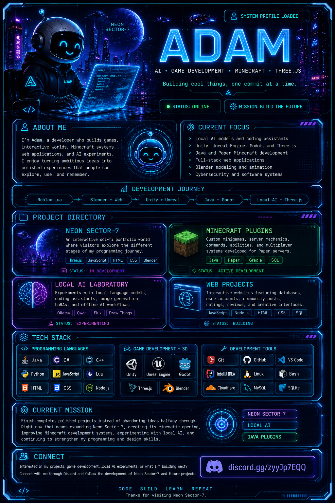

<!-- =========================
     MAIN PROFILE INTERFACE
========================== -->

  

<!-- =========================
     LIVE SYSTEM DATA
========================== -->

<h2>
  <code>&gt; LIVE_SYSTEM_DATA</code>
</h2>

  The interface above shows who I am and what I build.
  The information below updates automatically as I continue developing.

  

  

<!-- =========================
     LIVE STATUS
========================== -->

 

<!-- =========================
     CLICKABLE CONNECTIONS
========================== -->

<h2>
  <code>&gt; ESTABLISH_CONNECTION</code>
</h2>

  Follow my projects, join the development journey, and see what I build next.

  

  

<code>&gt; CODE. BUILD. LEARN. REPEAT.</code>

  

<strong>Thanks for visiting Neon Sector-7.</strong>

