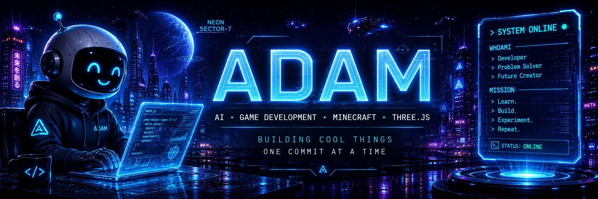

  

 

### `> SYSTEM PROFILE LOADED`

**Developer** • **Problem Solver** • **Game Builder** • **Future Creator**

 

---

## 🌌 `ABOUT_ME.exe`

> Turning ambitious ideas into interactive experiences, one project at a time.

I'm **Adam**, a developer focused on combining programming, game development, artificial intelligence, and digital creativity.

- 🤖 Experimenting with **local AI models** and coding assistants
- 🎮 Developing games with **Unity, Unreal Engine, Godot, and Three.js**
- ⛏️ Building **Minecraft plugins and minigames** with Java and Paper
- 🌐 Creating interactive websites with modern front-end tools and SQL databases
- 🧊 Designing 3D models, environments, and animations with Blender
- 🔐 Exploring cybersecurity, ethical hacking, and software systems
- 🚀 Building **Neon Sector-7**, an interactive world based on my coding journey

 

---

## 🚀 `PROJECT_DIRECTORY`

<table>
<tr>
<td width="50%" valign="top">

### 🌌 Neon Sector-7

An interactive sci-fi portfolio world where visitors explore locations representing different stages of my programming journey.

**Technology**

`Three.js` `JavaScript` `HTML` `CSS` `Blender`

**Status:** 🟢 In Development

</td>
<td width="50%" valign="top">

### ⛏️ Minecraft Games

Custom Minecraft minigames, server mechanics, commands, abilities, and multiplayer systems developed for Paper servers.

**Technology**

`Java` `Paper` `Gradle` `SQL`

**Status:** 🟢 Active Development

</td>
</tr>

<tr>
<td width="50%" valign="top">

### 🤖 Local AI Laboratory

Testing local language models, AI coding assistants, image-generation models, LoRAs, and offline development workflows.

**Technology**

`Ollama` `Qwen` `Flux` `Draw Things`

**Status:** 🔵 Experimenting

</td>
<td width="50%" valign="top">

### 🌐 Web Development

Interactive full-stack websites featuring accounts, databases, community posts, ratings, reviews, and creative user experiences.

**Technology**

`JavaScript` `Node.js` `HTML` `CSS` `SQL`

**Status:** 🟣 Building

</td>
</tr>
</table>

 

---

## ⚡ `TECH_STACK`

### Languages

  

### Game Development and 3D

  

### Development Tools

 

---

## 🛰️ `CURRENT_MISSION`

 

> **Current objective:** Build complete, polished projects while constantly improving my programming, design, and problem-solving skills.

 

---

## 📡 `DEVELOPMENT_ACTIVITY`

 

---

## 🧠 `LEARNING_QUEUE`

<table>
<tr>
<td align="center">🤖 <b>Local AI</b></td>
<td align="center">🌌 <b>Three.js</b></td>
<td align="center">☕ <b>Java Architecture</b></td>
<td align="center">🎮 <b>Game Systems</b></td>
<td align="center">🧊 <b>3D Graphics</b></td>
</tr>
</table>

 

---

## 🌐 `ESTABLISH_CONNECTION`

  

 

---

### `> CODE. BUILD. LEARN. REPEAT.`

**Thanks for visiting Neon Sector-7.**

