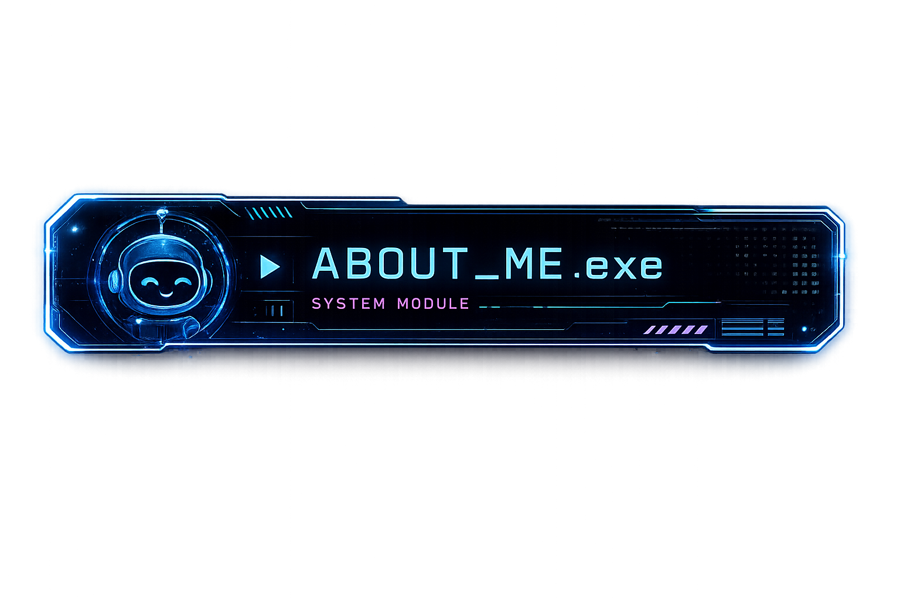
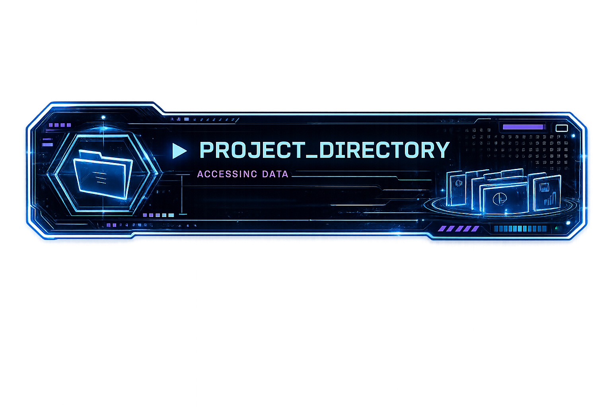
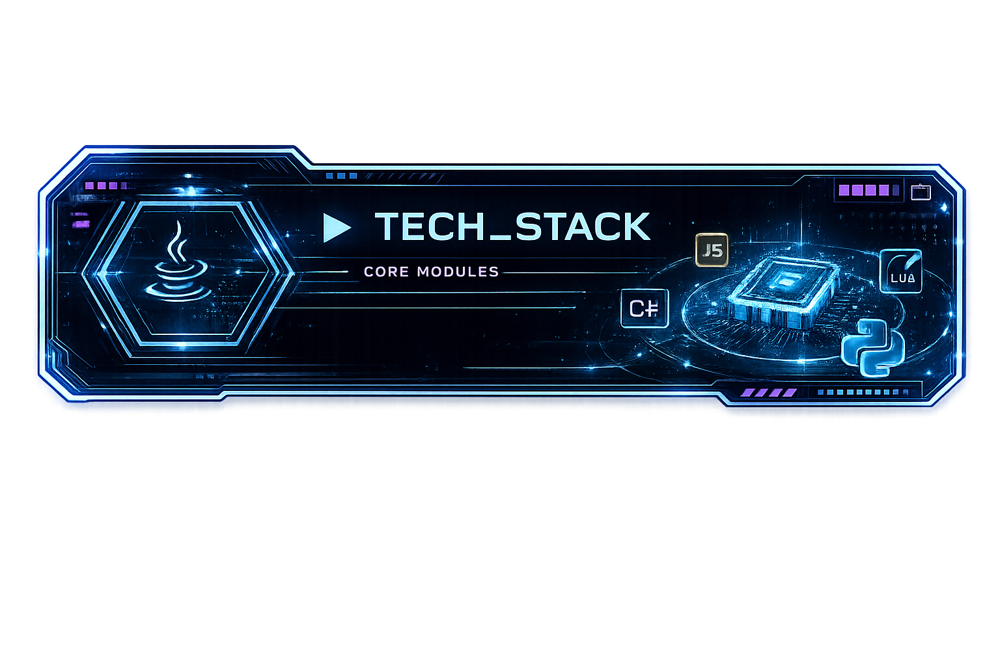
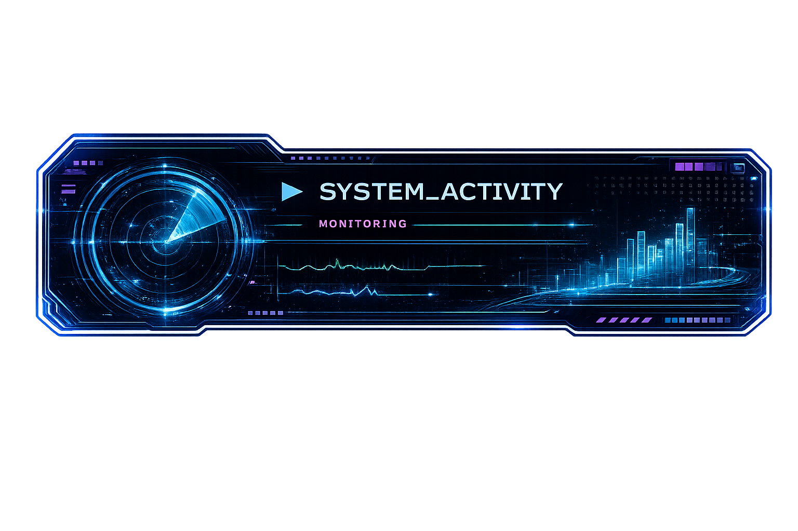
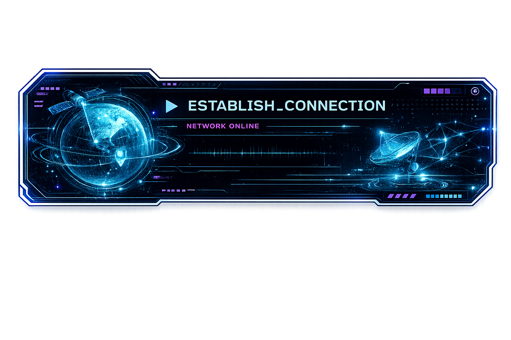

  

<code>&gt; SYSTEM PROFILE LOADED</code>

<h3>Developer • Problem Solver • Game Builder • Future Creator</h3>

I build games, interactive worlds, Minecraft systems, web applications,
AI experiments, and creative software.

My goal is to turn ambitious ideas into polished experiences that people can
explore, use, and remember.

<table>
<tr>
<td width="58%" valign="top">

<h3><code>PROFILE</code></h3>

I'm <strong>Adam</strong>, a developer interested in the point where
programming, artificial intelligence, game development, and digital creativity
all meet.

My coding journey started with Roblox Lua and gradually expanded into web
development, Blender, Unity, Unreal Engine, Godot, Java, Minecraft plugins,
cybersecurity, local AI, and interactive 3D graphics with Three.js.

I enjoy learning through ambitious projects. Instead of only following
tutorials, I like building complete systems, solving the problems that appear,
and improving the project until it feels like something uniquely mine.

</td>
<td width="42%" valign="top">

<h3><code>CURRENT FOCUS</code></h3>

<ul>
  <li>🤖 Local AI models and coding assistants</li>
  <li>🎮 Game systems and cinematic experiences</li>
  <li>🌌 Three.js and browser-based 3D worlds</li>
  <li>⛏️ Java and Paper Minecraft development</li>
  <li>🌐 Full-stack websites and SQL databases</li>
  <li>🧊 Blender modeling and animation</li>
  <li>🔐 Cybersecurity and software systems</li>
</ul>

</td>
</tr>
</table>

<code>ROBLOX LUA</code>
&nbsp;➜&nbsp;
<code>BLENDER + WEB</code>
&nbsp;➜&nbsp;
<code>UNITY + UNREAL</code>
&nbsp;➜&nbsp;
<code>JAVA + GODOT</code>
&nbsp;➜&nbsp;
<code>LOCAL AI + THREE.JS</code>

<table>
<tr>
<td width="50%" valign="top">

<h3>🌌 Neon Sector-7</h3>

My flagship project is an interactive sci-fi portfolio world built directly
for the browser.

Visitors control an astronaut and explore locations representing different
stages of my programming journey. The world includes animated characters,
camera-relative movement, explorable environments, futuristic UI, project
displays, and a cinematic opening sequence currently in development.

<strong>Core Systems</strong>

<code>Three.js</code>
<code>JavaScript</code>
<code>HTML</code>
<code>CSS</code>
<code>Blender</code>

<strong>Status:</strong> 🟢 In Development

</td>
<td width="50%" valign="top">

<h3>⛏️ Minecraft Plugins</h3>

Custom Minecraft minigames and multiplayer systems developed for Paper servers.

These projects include commands, abilities, team systems, capture-the-flag
mechanics, scoreboards, player statistics, game state management, database
integration, and server-side architecture written in Java.

<strong>Core Systems</strong>

<code>Java</code>
<code>Paper</code>
<code>Gradle</code>
<code>SQL</code>

<strong>Status:</strong> 🟢 Active Development

</td>
</tr>

<tr>
<td width="50%" valign="top">

<h3>🤖 Local AI Laboratory</h3>

An ongoing collection of experiments with offline artificial intelligence and
AI-assisted development.

I test local language models, compare coding performance, explore image
generation and LoRAs, build offline workflows, and experiment with how AI can
support programming, art, game development, and creative problem-solving.

<strong>Core Systems</strong>

<code>Ollama</code>
<code>Qwen</code>
<code>Flux</code>
<code>Draw Things</code>

<strong>Status:</strong> 🔵 Experimenting

</td>
<td width="50%" valign="top">

<h3>🌐 Web Projects</h3>

Creative websites that combine interactive interfaces with real backend
features.

My web projects include SQL databases, user accounts, community posts, ratings,
reviews, dynamic content, custom UI systems, and unusual concepts designed to
make each project feel different from a standard template.

<strong>Core Systems</strong>

<code>JavaScript</code>
<code>Node.js</code>
<code>HTML</code>
<code>CSS</code>
<code>SQL</code>

<strong>Status:</strong> 🟣 Building

</td>
</tr>
</table>

<h3><code>PROGRAMMING LANGUAGES</code></h3>

  

<h3><code>GAME DEVELOPMENT + 3D</code></h3>

  

<h3><code>DEVELOPMENT TOOLS</code></h3>

<table>
<tr>
<td width="33%" valign="top">

<h3 align="center">🎮 Game Systems</h3>

Unity 
Unreal Engine 
Godot 
Three.js 
Paper

</td>
<td width="33%" valign="top">

<h3 align="center">🧠 Creative Technology</h3>

Local AI 
Image Generation 
3D Modeling 
Animation 
Interactive Design

</td>
<td width="33%" valign="top">

<h3 align="center">⚙️ Development</h3>

Java Architecture 
Web Applications 
SQL Databases 
Git Workflows 
Server Systems

</td>
</tr>
</table>

<h3><code>CURRENT MISSION</code></h3>

Finish complete, polished projects instead of abandoning ideas halfway through.

Right now, that means expanding Neon Sector-7, creating its cinematic opening,
improving my Minecraft development systems, experimenting with local AI, and
continuing to strengthen my programming and design skills.

Interested in my projects, game development, local AI experiments, or what I'm
building next?

Connect with me through Discord and follow the development of Neon Sector-7 and
my future projects.

  

  

<code>&gt; CODE. BUILD. LEARN. REPEAT.</code>

<h3>Thanks for visiting Neon Sector-7.</h3>

This profile is the command center for everything I'm learning, building, and
planning to create next.

